# 目录

<!-- MarkdownTOC -->

- [第一章 绪论](#%E7%AC%AC%E4%B8%80%E7%AB%A0-%E7%BB%AA%E8%AE%BA)
	- [1.1 计算机控制系统](#11-%E8%AE%A1%E7%AE%97%E6%9C%BA%E6%8E%A7%E5%88%B6%E7%B3%BB%E7%BB%9F)
	- [1.2 系统组成](#12-%E7%B3%BB%E7%BB%9F%E7%BB%84%E6%88%90)
	- [1.3 系统的典型结构](#13-%E7%B3%BB%E7%BB%9F%E7%9A%84%E5%85%B8%E5%9E%8B%E7%BB%93%E6%9E%84)
	- [1.4 性能指标](#14-%E6%80%A7%E8%83%BD%E6%8C%87%E6%A0%87)
- [第二章 输入输出接口与过程通道技术](#%E7%AC%AC%E4%BA%8C%E7%AB%A0-%E8%BE%93%E5%85%A5%E8%BE%93%E5%87%BA%E6%8E%A5%E5%8F%A3%E4%B8%8E%E8%BF%87%E7%A8%8B%E9%80%9A%E9%81%93%E6%8A%80%E6%9C%AF)
	- [2.1 输入输出通道](#21-%E8%BE%93%E5%85%A5%E8%BE%93%E5%87%BA%E9%80%9A%E9%81%93)
	- [2.2 模拟量输入通道](#22-%E6%A8%A1%E6%8B%9F%E9%87%8F%E8%BE%93%E5%85%A5%E9%80%9A%E9%81%93)
		- [2.2.1 信号调理](#221-%E4%BF%A1%E5%8F%B7%E8%B0%83%E7%90%86)
		- [2.2.2 多路转换开关](#222-%E5%A4%9A%E8%B7%AF%E8%BD%AC%E6%8D%A2%E5%BC%80%E5%85%B3)
		- [2.2.3 可编程增益放大器](#223-%E5%8F%AF%E7%BC%96%E7%A8%8B%E5%A2%9E%E7%9B%8A%E6%94%BE%E5%A4%A7%E5%99%A8)
		- [2.2.4 采样保持器](#224-%E9%87%87%E6%A0%B7%E4%BF%9D%E6%8C%81%E5%99%A8)
		- [2.2.5 A/D转换器](#225-ad%E8%BD%AC%E6%8D%A2%E5%99%A8)
	- [2.3 模拟量输出通道](#23-%E6%A8%A1%E6%8B%9F%E9%87%8F%E8%BE%93%E5%87%BA%E9%80%9A%E9%81%93)
		- [2.3.1 零阶保持器](#231-%E9%9B%B6%E9%98%B6%E4%BF%9D%E6%8C%81%E5%99%A8)
		- [2.3.2 D/A转换器](#232-da%E8%BD%AC%E6%8D%A2%E5%99%A8)
		- [2.3.3 电压/电流转换器](#233-%E7%94%B5%E5%8E%8B%E7%94%B5%E6%B5%81%E8%BD%AC%E6%8D%A2%E5%99%A8)
	- [2.4 数字量输入/输出通道](#24-%E6%95%B0%E5%AD%97%E9%87%8F%E8%BE%93%E5%85%A5%E8%BE%93%E5%87%BA%E9%80%9A%E9%81%93)
		- [2.4.2. 数字量输入调理电路](#242-%E6%95%B0%E5%AD%97%E9%87%8F%E8%BE%93%E5%85%A5%E8%B0%83%E7%90%86%E7%94%B5%E8%B7%AF)
		- [2.4.3 数字量输出驱动电路](#243-%E6%95%B0%E5%AD%97%E9%87%8F%E8%BE%93%E5%87%BA%E9%A9%B1%E5%8A%A8%E7%94%B5%E8%B7%AF)
	- [2.6 测量数据预处理](#26-%E6%B5%8B%E9%87%8F%E6%95%B0%E6%8D%AE%E9%A2%84%E5%A4%84%E7%90%86)
		- [2.6.1 数字滤波](#261-%E6%95%B0%E5%AD%97%E6%BB%A4%E6%B3%A2)
		- [2.6.2.1 标度变换](#2621-%E6%A0%87%E5%BA%A6%E5%8F%98%E6%8D%A2)
		- [2.6.2.2 误差校准](#2622-%E8%AF%AF%E5%B7%AE%E6%A0%A1%E5%87%86)
- [第三章 工业控制计算机](#%E7%AC%AC%E4%B8%89%E7%AB%A0-%E5%B7%A5%E4%B8%9A%E6%8E%A7%E5%88%B6%E8%AE%A1%E7%AE%97%E6%9C%BA)
	- [3.1 工业控制计算机特点结构](#31-%E5%B7%A5%E4%B8%9A%E6%8E%A7%E5%88%B6%E8%AE%A1%E7%AE%97%E6%9C%BA%E7%89%B9%E7%82%B9%E7%BB%93%E6%9E%84)
		- [3.1.1 工业控制计算机特点](#311-%E5%B7%A5%E4%B8%9A%E6%8E%A7%E5%88%B6%E8%AE%A1%E7%AE%97%E6%9C%BA%E7%89%B9%E7%82%B9)
		- [3.1.2 工业控制计算机分类](#312-%E5%B7%A5%E4%B8%9A%E6%8E%A7%E5%88%B6%E8%AE%A1%E7%AE%97%E6%9C%BA%E5%88%86%E7%B1%BB)
	- [3.2 工业控制计算机总线结构](#32-%E5%B7%A5%E4%B8%9A%E6%8E%A7%E5%88%B6%E8%AE%A1%E7%AE%97%E6%9C%BA%E6%80%BB%E7%BA%BF%E7%BB%93%E6%9E%84)
		- [3.2.1 总线分类](#321-%E6%80%BB%E7%BA%BF%E5%88%86%E7%B1%BB)
		- [3.2.2 常用的内部和外部总线](#322-%E5%B8%B8%E7%94%A8%E7%9A%84%E5%86%85%E9%83%A8%E5%92%8C%E5%A4%96%E9%83%A8%E6%80%BB%E7%BA%BF)
- [第五章 数字PID控制算法](#%E7%AC%AC%E4%BA%94%E7%AB%A0-%E6%95%B0%E5%AD%97pid%E6%8E%A7%E5%88%B6%E7%AE%97%E6%B3%95)
	- [5.1 准连续PID控制算法](#51-%E5%87%86%E8%BF%9E%E7%BB%ADpid%E6%8E%A7%E5%88%B6%E7%AE%97%E6%B3%95)
		- [5.1.1 模拟PID调节器算法](#511-%E6%A8%A1%E6%8B%9Fpid%E8%B0%83%E8%8A%82%E5%99%A8%E7%AE%97%E6%B3%95)
		- [5.1.2 数字PID调节器算法](#512-%E6%95%B0%E5%AD%97pid%E8%B0%83%E8%8A%82%E5%99%A8%E7%AE%97%E6%B3%95)
	- [5.2 数字PID改进](#52-%E6%95%B0%E5%AD%97pid%E6%94%B9%E8%BF%9B)
		- [5.2.1 积分分离](#521-%E7%A7%AF%E5%88%86%E5%88%86%E7%A6%BB)
		- [5.2.2 不完全微分](#522-%E4%B8%8D%E5%AE%8C%E5%85%A8%E5%BE%AE%E5%88%86)
	- [5.3 数字PID参数整定](#53-%E6%95%B0%E5%AD%97pid%E5%8F%82%E6%95%B0%E6%95%B4%E5%AE%9A)
		- [5.3.1 PID控制器参数对性能影响](#531-pid%E6%8E%A7%E5%88%B6%E5%99%A8%E5%8F%82%E6%95%B0%E5%AF%B9%E6%80%A7%E8%83%BD%E5%BD%B1%E5%93%8D)
		- [5.3.3 参数整定方法。](#533-%E5%8F%82%E6%95%B0%E6%95%B4%E5%AE%9A%E6%96%B9%E6%B3%95%E3%80%82)
- [第六章 复杂控制算法](#%E7%AC%AC%E5%85%AD%E7%AB%A0-%E5%A4%8D%E6%9D%82%E6%8E%A7%E5%88%B6%E7%AE%97%E6%B3%95)
	- [6.3 纯滞后控制](#63-%E7%BA%AF%E6%BB%9E%E5%90%8E%E6%8E%A7%E5%88%B6)
		- [6.3.1 施密斯预估控制](#631-%E6%96%BD%E5%AF%86%E6%96%AF%E9%A2%84%E4%BC%B0%E6%8E%A7%E5%88%B6)
	- [6.4 多回路控制](#64-%E5%A4%9A%E5%9B%9E%E8%B7%AF%E6%8E%A7%E5%88%B6)
		- [6.4.1 串级控制](#641-%E4%B8%B2%E7%BA%A7%E6%8E%A7%E5%88%B6)
		- [6.4.1 前馈控制](#641-%E5%89%8D%E9%A6%88%E6%8E%A7%E5%88%B6)
	- [6.6 模糊控制](#66-%E6%A8%A1%E7%B3%8A%E6%8E%A7%E5%88%B6)
		- [6.6.1 模糊控制的四个模块](#661-%E6%A8%A1%E7%B3%8A%E6%8E%A7%E5%88%B6%E7%9A%84%E5%9B%9B%E4%B8%AA%E6%A8%A1%E5%9D%97)
		- [6.6.2 隶属度、隶属函数](#662-%E9%9A%B6%E5%B1%9E%E5%BA%A6%E3%80%81%E9%9A%B6%E5%B1%9E%E5%87%BD%E6%95%B0)
		- [6.6.3 清晰化](#663-%E6%B8%85%E6%99%B0%E5%8C%96)
- [第七章 计算机控制系统的软件设计](#%E7%AC%AC%E4%B8%83%E7%AB%A0-%E8%AE%A1%E7%AE%97%E6%9C%BA%E6%8E%A7%E5%88%B6%E7%B3%BB%E7%BB%9F%E7%9A%84%E8%BD%AF%E4%BB%B6%E8%AE%BE%E8%AE%A1)
	- [7.1 计算机控制系统软件概述](#71-%E8%AE%A1%E7%AE%97%E6%9C%BA%E6%8E%A7%E5%88%B6%E7%B3%BB%E7%BB%9F%E8%BD%AF%E4%BB%B6%E6%A6%82%E8%BF%B0)
		- [7.1.1 控制系统软件的组成](#711-%E6%8E%A7%E5%88%B6%E7%B3%BB%E7%BB%9F%E8%BD%AF%E4%BB%B6%E7%9A%84%E7%BB%84%E6%88%90)
		- [7.1.2 控制系统软件的功能](#712-%E6%8E%A7%E5%88%B6%E7%B3%BB%E7%BB%9F%E8%BD%AF%E4%BB%B6%E7%9A%84%E5%8A%9F%E8%83%BD)
	- [7.4 工业组态软件](#74-%E5%B7%A5%E4%B8%9A%E7%BB%84%E6%80%81%E8%BD%AF%E4%BB%B6)
		- [7.4.1 工业组态软件](#741-%E5%B7%A5%E4%B8%9A%E7%BB%84%E6%80%81%E8%BD%AF%E4%BB%B6)
- [第八章 分布式计算机控制系统](#%E7%AC%AC%E5%85%AB%E7%AB%A0-%E5%88%86%E5%B8%83%E5%BC%8F%E8%AE%A1%E7%AE%97%E6%9C%BA%E6%8E%A7%E5%88%B6%E7%B3%BB%E7%BB%9F)
	- [8.2 DCS的体系结构](#82-dcs%E7%9A%84%E4%BD%93%E7%B3%BB%E7%BB%93%E6%9E%84)
		- [8.2.1 DCS层次结构](#821-dcs%E5%B1%82%E6%AC%A1%E7%BB%93%E6%9E%84)
		- [8.2.2 DCS硬件结构](#822-dcs%E7%A1%AC%E4%BB%B6%E7%BB%93%E6%9E%84)
		- [8.2.3 DCS软件结构](#823-dcs%E8%BD%AF%E4%BB%B6%E7%BB%93%E6%9E%84)
		- [8.3.2 DCS问题缺点](#832-dcs%E9%97%AE%E9%A2%98%E7%BC%BA%E7%82%B9)
- [第九章 计算机控制系统设计与实现](#%E7%AC%AC%E4%B9%9D%E7%AB%A0-%E8%AE%A1%E7%AE%97%E6%9C%BA%E6%8E%A7%E5%88%B6%E7%B3%BB%E7%BB%9F%E8%AE%BE%E8%AE%A1%E4%B8%8E%E5%AE%9E%E7%8E%B0)
	- [9.1 系统设计的原则与步骤](#91-%E7%B3%BB%E7%BB%9F%E8%AE%BE%E8%AE%A1%E7%9A%84%E5%8E%9F%E5%88%99%E4%B8%8E%E6%AD%A5%E9%AA%A4)
		- [9.1.1 设计原则](#911-%E8%AE%BE%E8%AE%A1%E5%8E%9F%E5%88%99)
		- [9.1.2 设计步骤](#912-%E8%AE%BE%E8%AE%A1%E6%AD%A5%E9%AA%A4)

<!-- /MarkdownTOC -->

## 第一章 绪论

### 1.1 计算机控制系统

- **什么是计算机控制系统**

	计算机控制系统就是 **利用计算机** (通常称为工业控制计算机)来 **实现控制对象**（通常为生产过程）**自动控制的系统**。

- **计算机控制系统包括**

	- 控制计算机 (包括硬件、软件和网络)
	- 生产过程 (包括被控对象、检测传感器、执行机构）

- **计算机控制系统的三大基本要素:**

	A/D通道，D/A通道，计算机

---

### 1.2 系统组成

- **系统硬件(4)**
	- 主机
	- 常规外部设备
	- 过程输入/输出通道
	- 生产过程
	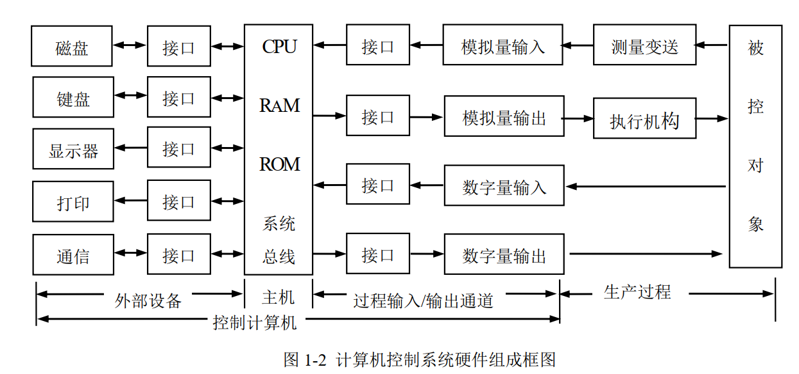

- **系统软件(2)**
	- 系统软件
	- 应用软件

---

### 1.3 系统的典型结构

- **操作指导控制系统 OGC**
	
	只需要完成数据采集与处理的场合	

- **直接数字控制系统 DDC**

	需要数据采集、控制决策、控制输出等多用途场合

- **计算机监督控制系统 SCC**

	主要完成数据采集与处理，一般无需对数据进行复杂的工艺分析与计算的场合

- **集散控制系统 DCS**

	需要复杂计算机控制的场合

- **现场总线控制系统 FCS**

	工厂自动化领域	

- **工业过程计算机集成制造系统 CIMS**

	用于流程工业

---

### 1.4 性能指标

- **稳定裕量**
	
	稳定性是对控制系统的最基本的要求

	用稳定裕量（相角裕量和幅值裕量）来衡量计算机控制系统的稳定程度。	

- **动态指标**
	
	反应控制系统过渡过程特性

	- 延迟时间 td 
	- 上升时间 tτ （评价响应速度）
	- 峰值时间 tp （评价响应速度）
	- 调节时间 ts （反应响应速度和阻尼程度的综合指标）
	- 超调量 σ%   （评价阻尼程度）

- **稳态指标**

	反应控制系统精度或抗干扰能力的一种度量

	- 稳态误差 ess

- **综合指标**
	
	积分型指标是主要的综合性指标之一

## 第二章 输入输出接口与过程通道技术

### 2.1 输入输出通道
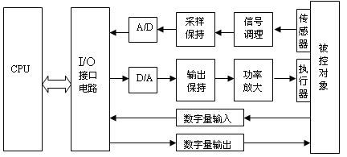

---

### 2.2 模拟量输入通道
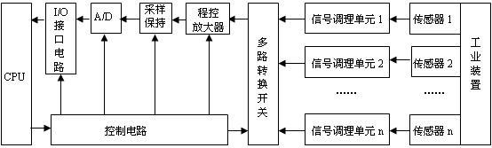

#### 2.2.1 信号调理

- **标准信号**
	- 4-20mA
	- 0-5V

- **信号调理的主要作用**
	- 将传感器输出的电信号尽可能不失真地变为标准的电流或电压信号,信号调理单元也叫变送器

- **电桥电路**
	- 电桥电路是最常见的信号调理电路之一，通常用于微电压、热电偶和应变测量中。

- **放大器的作用**
	- 对信号幅度放大	
	- 增大输入阻抗，起到 隔离和缓冲前后级单元的作用	
	- 抑制噪声，提高信噪比	
	- 其他作用，如电压/电流变换、量程切换、极性自动变换等	

- **仪表放大器**
	
	- 高输入阻抗、低输出阻抗
	- 抗共模电压干扰能力强
	- 低温漂、低失调电压、高稳定增益
	- 能附加特定要求的电路
	
- **隔离放大器**
	- (目的) 在有强电或强电磁干扰的环境，防止电网电压或其他电磁干扰测量回路。
	- (作用) 在输入信号和输出信号之间保持电气隔离的同时实现输出电压与输入电压的线性传输。
	- 两端口
		- 信号输入部分、信号输出部分
	- 三端口
		- 信号输入部分、信号输出部分、电源部分
	- 分为三种：电磁隔离、光隔离、电容隔离

- **电流电压转换器**
	- (作用) 将传感器输出的非标准电压信号转换为A/D转换器能直接采集的电压信号

	- 二线制变送器 

	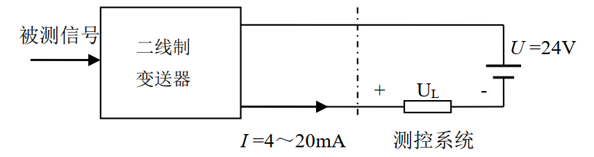

	- 无源I/V变换
	
	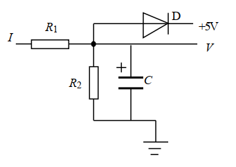

	- 有源同向输入I/V变换
	
	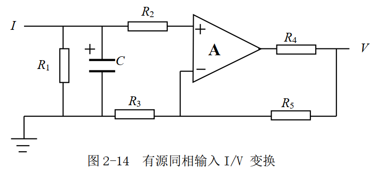

	- 有源反向输入I/V变换
	
	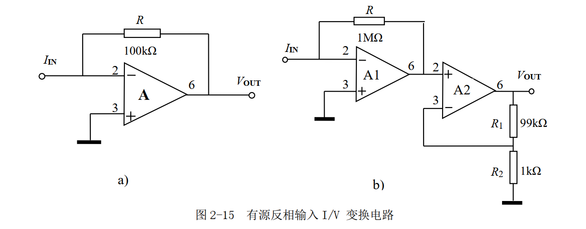

#### 2.2.2 多路转换开关

- **目的**

	轮流切换各被控或被测回路与A/D、D/A转换电路间的通路，以达到分时复用的目的

#### 2.2.3 可编程增益放大器

- **作用**

	在计算机测控系统的模拟输入通道中，由于被测量所处的环境和时间不同，可能会造成其变化范围不同，因此希望能自动改变放大器的增益，使信号通过放大器后，具有合适的动态范围，即实现自动里程切换，以便于A/D转换。

#### 2.2.4 采样保持器

- **采样保持器的作用**
	
	如果A/D输入的模拟信号变化频率较高且影响转换精度时，则需在A/D转换之前加入采样保持器，使得A/D在转换期间，输入的模拟信号保持不变，从而保证A/D转换精度。

- **什么情况可以不使用采样保持器**
	
	如果采用的模拟信号变化频率较低，不至于影响A/D转换精度时，可无需采用采样保持器。

- **采样保持器的主要参数**

	- **孔径时间 TAP**： 在采样保持器中，由于模拟开关有一定的动作滞后，从保持命令发出后至模拟开关完全断开所需的时间称为孔径时间，一般是纳秒级。这个时间由器件的开关动作时间决定。理想情况是越小越好。

	- **捕捉时间 TAC**： 采样保持器处于保持模式时，从计算机发出采样命令，由“保持”转为“采样”后，采样保持器的输出值由原来的保持值过渡到跟踪当前输入信号值所需的时间，也称为捕捉时间 

	- **保持电压下降率**： 在进入保持阶段后，由于开关的漏电流及保持电容泄漏，输出电压会下降，以v/s表示。在选择保持电容的容量时要折中地考虑采集时间和下跌率。

- **采样保持器的工作原理**

	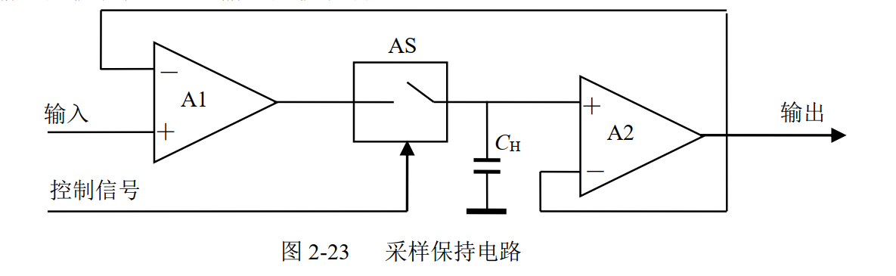
	采样保持电路有两种工作状态，一是采样状态，二是保持状态。当模拟开关AS闭合时，进入采样状态，当AS打开，进入保持状态。

#### 2.2.5 A/D转换器

- **技术指标**

	- **分辨率** 常用数字量的位数n来表示，如8位、12位、16位等。
	- **量化误差**
	ADC把模拟量变为数字量，用数字量近似表示模拟量，这个过程称为量化。量化误差是ADC的有限位数对模拟量进行量化而引起的误差，常用最大相对量化误差表示，如12位ADC的量化误差为1/212\*100%。
	- **量程**  它是指所能转换的电压范围
	- **转换精度**  它是指转换后所得结果相对于实际值的准确度。
	- **转换时间（即孔径时间TA/D）** 指完成一次模拟量到数字量转换所需要的时间。
	- **工作温度范围**  满足转换精度指标的工作环境温度范围，较好的A/D转换器的工作温度为-40～85℃，较差的为0～70℃。

---

### 2.3 模拟量输出通道

- **每个输出通道设置一个D/A转换器的结构形式**

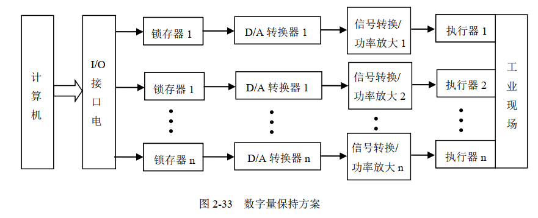

- **多个输出通道共用一个D/A转换器的结构形式**

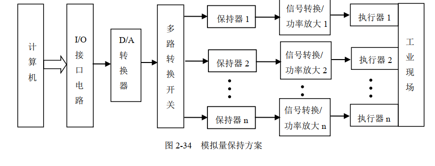

#### 2.3.1 零阶保持器

- **作用**

	在模拟量输出通道中，当D/A转换器通过多路转换开关实现分时复用时，需要采用零阶保持器，将该路输出的模拟信号原封不动地保持到下一个采样时期。

- **两种零阶保持器**

	- 步进电动机带动多圈电位器，因为步进电动机走步后能保持其角位移不变，从多圈电位器输出的电压也就保持不变；

	- 与采样保持器一样的电容保持器。

#### 2.3.2 D/A转换器

- **技术指标**

	- **分辨率** 指D/A能够转换的二进制数的位数，位数越多分辨率也越高。

	- **稳定时间(转换时间)** D/A转换器输入发生满量程值变化时，其输出达到并保持在所允许的误差范围内所需要的时间

	- **精度** 指D/A转换器实际输出电压与理论值之间的误差

	- **线性度** 当数字量变化时，D/A转换器的输出量按比例关系变化的程度。

	- **温度范围** 满足转换精度指标的工作环境温度范围

#### 2.3.3 电压/电流转换器

因为在长距离传输信号时容易引入干扰，而电流传号的传输具有较强的抗干扰能力

---

### 2.4 数字量输入/输出通道 

- 开关量： 电平式 触点式

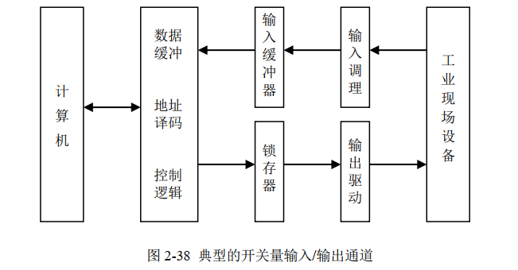

- **CPU 接口逻辑电路** 

	一般由数据总线缓冲器/驱动器、输入/输出口地址译码器、读写等控制信号组成。

- **输入缓冲器和输出锁存器**

	输入缓冲器是对外部输入的信号起缓冲、增强以及选通的作用,CPU通过缓冲器读输入数据。输出锁存器的作用是锁存CPU 送来的输出数据，供外部设备使用。

- **输入/输出电气接口**

	典型的开关量输入/输出电气接口的功能主要是滤波、电平转换、隔离和功率驱动等

#### 2.4.2. 数字量输入调理电路

- **小功率输入调理电路**

	从开关、继电器等接点输入信号的电路，它将接点的接通和断开状态，转换成 TTL 电平信号与计算机相连

- **大功率输入调理电路**

	若从电磁离合器等大功率器件的接点输入信号，为使接点工作可靠，接点两端至少要加 24V 以上的直流电压

#### 2.4.3 数字量输出驱动电路

- **小功率驱动电路**

	一般用于驱动发光二极管、LED显示器、小功率继电器等元件或装置，要求电路的驱动能力一般为10～40mA

- **中功率驱动电路**

	常用于驱动中功率继电器、电磁开关等中功率装置，一般要求具有50～500mA的驱动能力

- **大功率交流驱动电路**

	输入输出之间采用光电耦合器进行隔离	

---

### 2.6 测量数据预处理

#### 2.6.1 数字滤波 

如果同时采用几种滤波方法，一般先用中位值滤波法或限幅滤波法，然后再用平均值滤波法。

- **限幅滤波**
	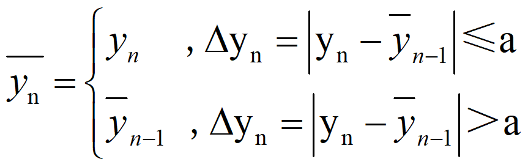

- **中位值滤波**

	中位值滤波就是对某一被测参数连续采样n次（一般n取奇数），然后把n次采样值按大小排队，取中间值为本次采样值。 	
	- 适用：偶然的脉冲干扰，缓慢的变化过程

- **算数平均值滤波**

	算术平均滤波法就是对采样数据yi连续的N个测量值进行算术平均

	- 适用：随机干扰

- **递推平均滤波**

	递推平均滤波法把N个采样数据看成一个队列，队列的长度固定为N，每进行一次新的采样，把采样结果放入队尾，而扔掉原来队首的一次数据

	- 适用：周期性干扰 高频振荡的系统 

- **加权递推平均滤波**

	为了增加最新采样数据在递推平均中的比重，以提高系统对当前采样值的灵敏度，可以采用加权递推平均滤波算法

	- 适用：有较大纯滞时间常数的对象和采样周期较短的系统

- **一阶惯性滤波**

	而一阶惯性滤波算法是一种以数字形式通过算法来实现动态的RC 滤波方法

	- 适用：高频及低频的干扰信号

#### 2.6.2.1 标度变换	

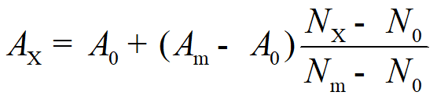

A0——一次测量仪表的下限；

Am——一次测量仪表的上限；

Ax——实际测量值（工程量）；

N0——仪表下限对应的数字量；

Nm——仪表上限对应的数字量；

Nx——测量值所对应的数字量。

#### 2.6.2.2 误差校准	

- 全自动校准
	只适于基准参数是电信号的场合，并且它不能校准由传感器引入的误差	

	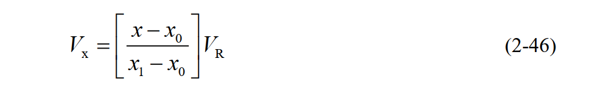

	VR ——基准电压

	x0——零输入时A/D转换器的输出

	x1 ——基准电压VR输入时的输出

- 人工自动校准

	人工校准输入信号 yR 时，测出的数据为 xR， 则可按下式来计算 y
	
	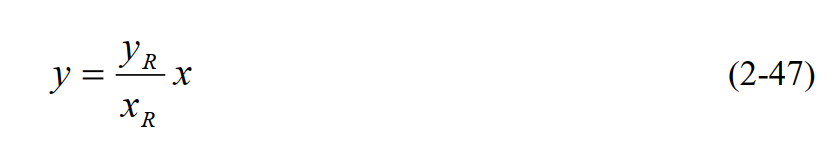

## 第三章 工业控制计算机

### 3.1 工业控制计算机特点结构

#### 3.1.1 工业控制计算机特点

- 可靠性高
- 实时性好
- 环境适应能力强
- 输入和输出模板配套好
- 系统通信功能强
- 系统开放性和扩充性好
- 控制软件包功能强
- 后备措施齐全和具有冗余性

#### 3.1.2 工业控制计算机分类

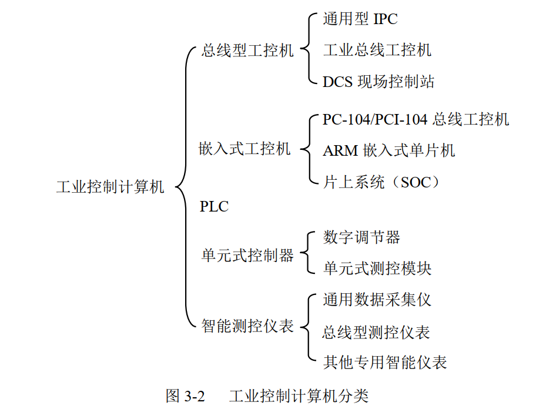

---

### 3.2 工业控制计算机总线结构

#### 3.2.1 总线分类

- **片内总线**

	片内总线是指微处理器芯片内的总线

- **片间总线**
	
	指一个微处理器应用系统中连接各芯片的总线。

- **内部总线**

	是在计算机系统内连接各插件板的总线

- **外部总线**

	它完成计算机系统之间或计算机与设备之间的通信任务

#### 3.2.2 常用的内部和外部总线

- **内部总线**
	- PC 系列总线
	- Compact PCI 总线
- **外部总线**
	- **RS-232C 串行通信接口**
		- RS-232C逻辑电平为正负15V，与TTL电平不兼容，与计算机之间需要转换器；

		- RS-232C数据发送和接收线独立，全双工，主要用于点对点通信，不分主从，节点较少；

		- RS-232C采用非平衡型电平传输，抗干扰能力弱，传输速率低（不超过19.2kbps），传输距离短（不超过15m）；

	- **RS-485 串行通信接口**

		- RS-485逻辑电平与TTL兼容，与计算机之间无需复杂的电平转换；

		- RS-485采用二线制链接方式构成总线式拓扑结构，半双工，实现主从方式的网络通信，同一个总线回路一般最多可支持32个节点；

		- RS-485采用二线差分平衡传输，抗干扰能力较强，传输速率较高（不超过10mbps），传输距离较远（理论不超过3km，实际使用一般不超过1.2km）。

	- IEEE-488 总线

## 第五章 数字PID控制算法

### 5.1 准连续PID控制算法

#### 5.1.1 模拟PID调节器算法

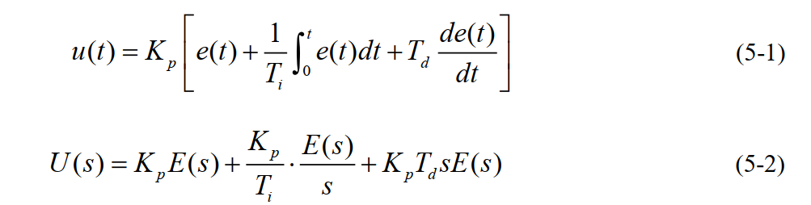

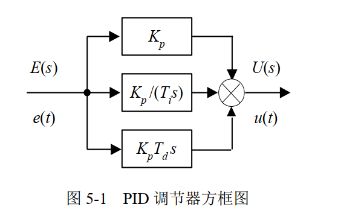

#### 5.1.2 数字PID调节器算法

- **离散化**

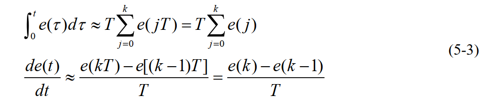

- **离散PID算法**

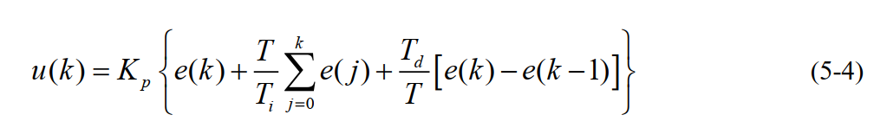

- **位置式PID算式**

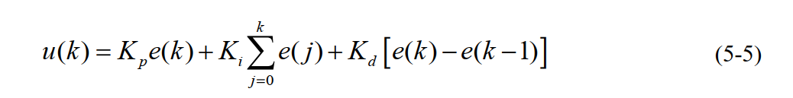

- **增量式PID算式**

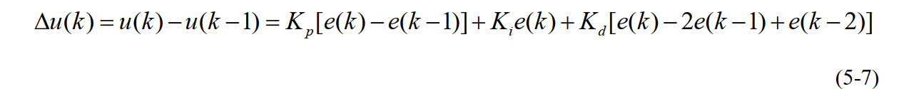

- **递推式PID算式**

	从控制器的传递函数推导其离散控制算法的一般方法，仍以模拟 PID 调节器为例，式(5-2)改写为

	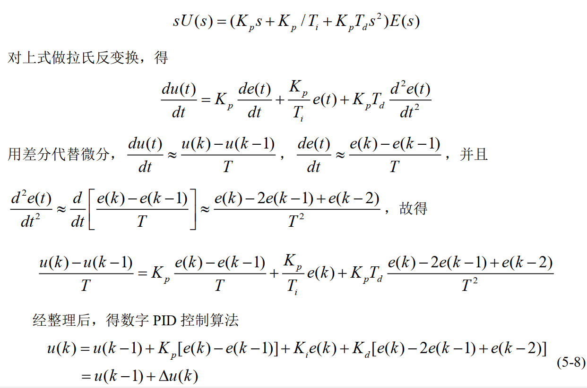

---

### 5.2 数字PID改进

#### 5.2.1 积分分离

- **原因**

	积分作用下可能会导致执行机构进入饱和状态，结果产生系统输出的较大超调，甚至长时间振荡。

- **作用**

	既保持了积分作用，又可减少超调量。

- **基本思想**

	偏差较大时暂时取消积分作用，偏差小于某个阈值时才引入积分作用。

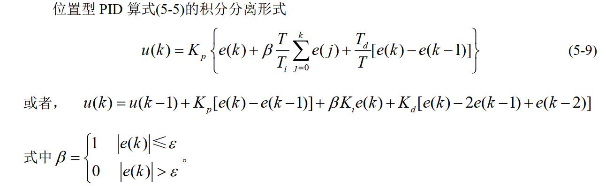

#### 5.2.2 不完全微分

- **原因**

	微分控制有如下特点：

	- 控制仅在第一个周期内起作用，对于时间常数较大的系统，其调节作用很小，不能达到超前控制误差的目的

	- ud(k) 的幅值一般较大（因 T<<Td ），容易在以单片微机为核心的计算机控制系统中造成数据溢出

	- ud(k) 过大、过快的变化会对执行机构造成冲击，不利于执行机构安全运行。另外，由于控制周期很短，驱动像阀门这一类执行机构动作需要一定的时间，若输出较大，阀门一下子达不到应有的开度，输出将失真

- **作用**

	克服上述缺点

- **基本思想**

	- **方法一** 在PID算法中加一个一阶惯性环节（低通滤波器）

	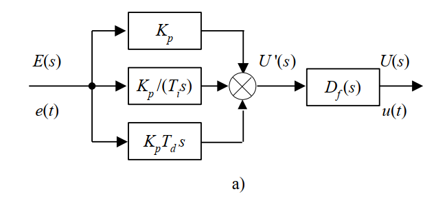

	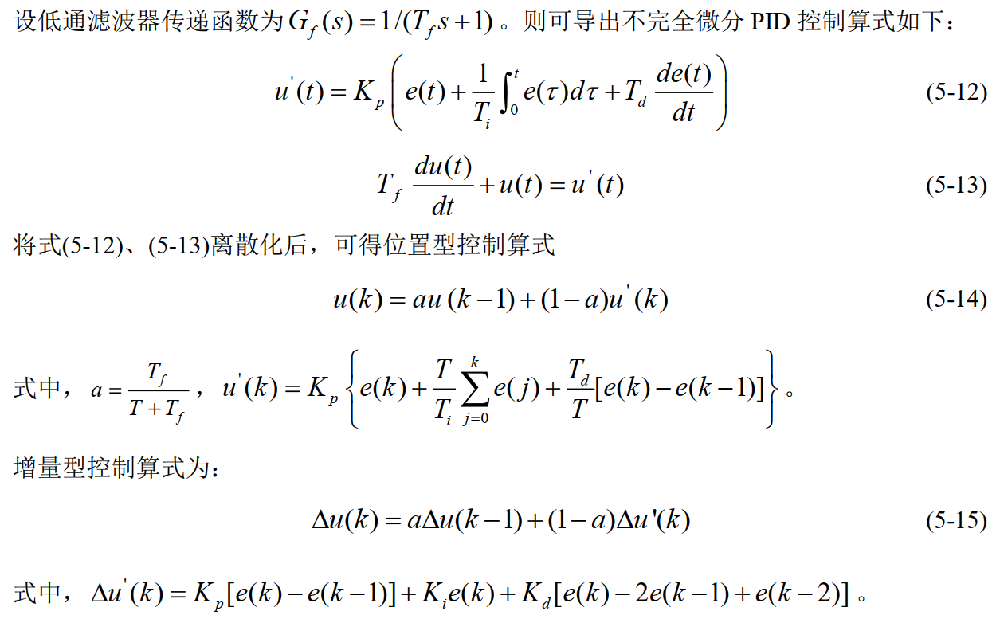

	- **方法二** 将低通滤波器直接加在微分控制环节上

	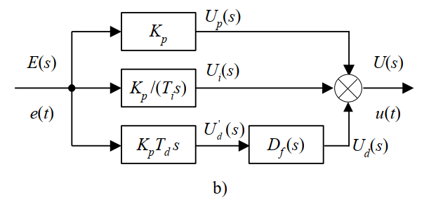

	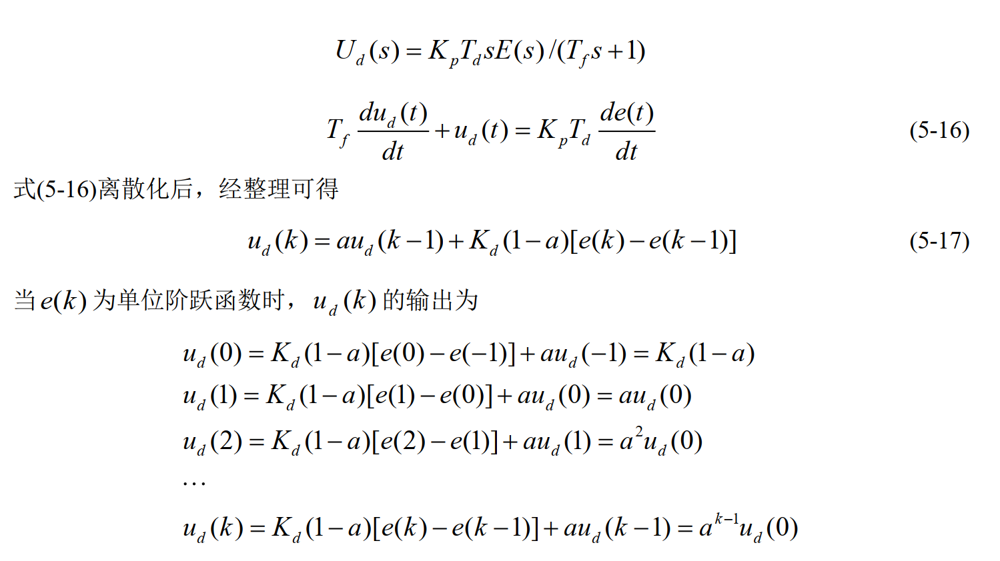

---

### 5.3 数字PID参数整定

#### 5.3.1 PID控制器参数对性能影响

- **Kp**
	
	- **动态性能**  Kp ↑  动作灵敏，响应速度加快，振荡次数增加，调节时间拉长。

	- **静态性能**  Kp ↑  系统稳定的情况下，减少静差ess，提高控制精度，但不能消除静差。

- **Ki**
	
	- **动态性能**  Ki ↑  系统振荡次数增多。

	- **静态性能**  消除静差。

- **Kd**
	
	- **动态性能**  改善系统动态性能，减少超调量和调节时间。

#### 5.3.3 参数整定方法。

- **临界比例法**

	适用于具有自平衡型的被控对象

	**方法**

	1. 将控制器设置为比例（P）控制器，形成闭环，改变比例系数，使得系统对阶跃输入的响应达到临界振荡状态（临界稳定）。

	2. 将这时的比例系数记为Kr ，振荡周期记为Tr 。

	3. 根据齐格勒-尼柯尔斯（Ziegle-Nichols）经验公式得到不同类型调节器的调节参数。

- **扩充临界比例法**
	
	以临界比例法为基础的一种数字PID控制器参数整定方法

	**方法**

	1. 选择合适的初始采样周期T0，控制器采用纯比例控制，渐渐改变比例系数，使控制系统出现临界振荡。

	2. 记录 Kr 和 Tr 。

	3. 选择控制度Q，控制度Q的定义是以数字PID控制和模拟PID控制所对应的过渡过程误差平方的积分之比

	4. 按表选择T、Kp、Ti、Td

- **扩充响应曲线法**

	数字控制器参数的整定中也可以采用类似模拟控制器的响应曲线法，称为扩充响应曲线法

	**方法**

	1. 预先在对象动态响应曲线上求出等效纯滞后时间τ，等效惯性时间常数Tm，以及它们的比值Tm/τ。

	2. 其余步骤与扩充临界比例法相似。 

- **归一参数整定法**

	简化整定工作

	**方法**

	根据大量实际经验的总结，设定了一些约束条件，以减少独立变量的个数，只有一个参数Kp需要整定。

- **凑试法**

	**方法**

	先比例，后积分，再微分

## 第六章 复杂控制算法

### 6.3 纯滞后控制

#### 6.3.1 施密斯预估控制

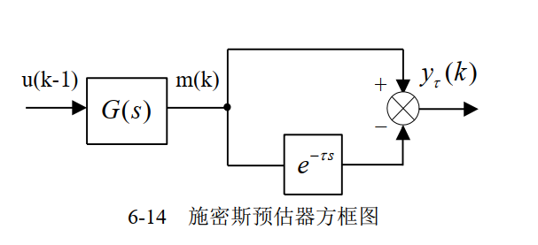

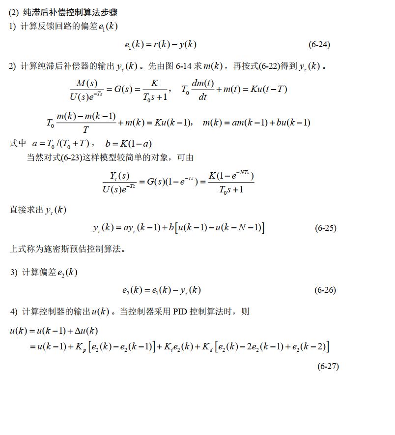

---

### 6.4 多回路控制

#### 6.4.1 串级控制

- **为什么使用串级控制**

	系统中同时有几个因素影响一个被控量，只控制一个因素难以满足性能要求。

#### 6.4.1 前馈控制

- **前馈控制结构**

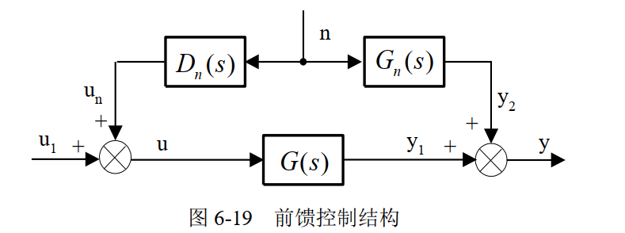

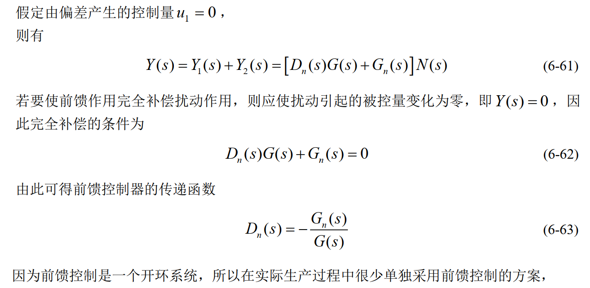

- **前馈-反馈控制结构**

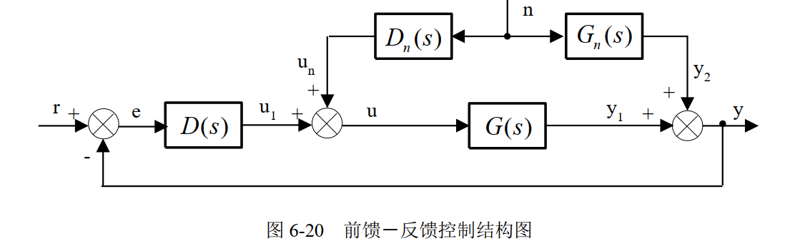

- **数字前馈-反馈控制算法**

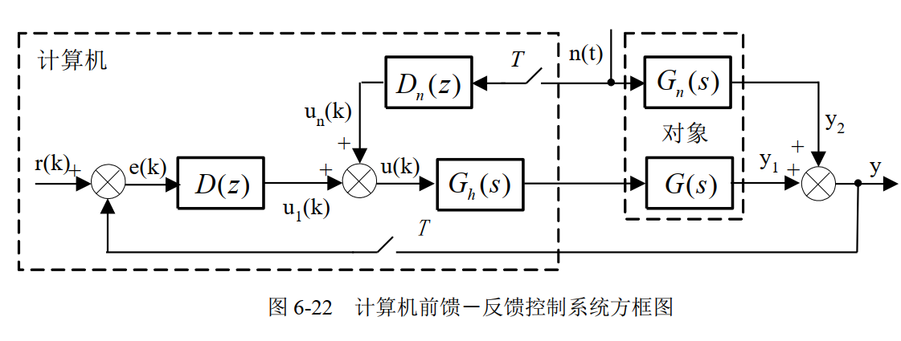
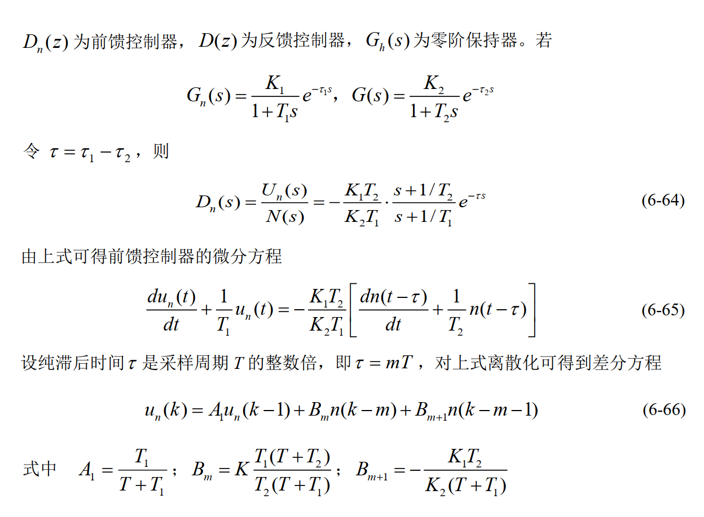
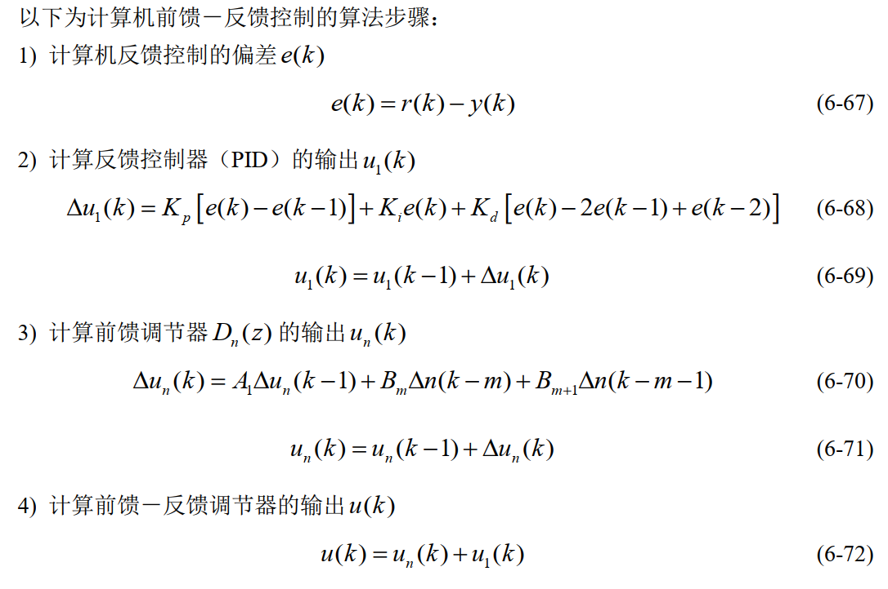

### 6.6 模糊控制

#### 6.6.1 模糊控制的四个模块

- 模糊化

- 知识库（数据库和模糊控制规则库）

- 模糊推理

- 清晰化

#### 6.6.2 隶属度、隶属函数

- **隶属度**

	用[0,1]中的一个实数μ去度量元素属于某子模糊集合的程度

- **隶属函数**

	考虑到整个论域X中的所有元素的隶属度时，它就成为一个以论域U为定义的函数，这个函数就叫“隶属函数”	

#### 6.6.3 清晰化

- 选择隶属度大的原则

- 加权平均原则

- 中位数判决

## 第七章 计算机控制系统的软件设计

### 7.1 计算机控制系统软件概述

#### 7.1.1 控制系统软件的组成

- **系统软件**  计算机控制系统应用软件开发平台和操作平台

- **应用软件**  可按用途划分为监控平台软件、基本控制软件、先进控制软件、局部优化软件、操作优化软件、最优调度软件和企业计划决策软件等

#### 7.1.2 控制系统软件的功能

- 实时数据采集

- 控制输出

- 控制运算

- 报警监视

- 画面显示和报表输出

- 可靠性功能

- 管理功能

- 通信功能

- 流程画面制作功能

---

### 7.4 工业组态软件

#### 7.4.1 工业组态软件

- **基本组成**

	- 系统开发环境

	- 系统运行环境

- **特点**

	- 实时多任务

	- 接口开放

	- 使用灵活

	- 功能多样

	- 运行可靠

## 第八章 分布式计算机控制系统

### 8.2 DCS的体系结构

#### 8.2.1 DCS层次结构

- 直接控制层

- 操作监控层

- 生产管理层

- 决策管理层

#### 8.2.2 DCS硬件结构

- **控制单元**

- **输入/输出单元**

- 电源单元

- 机柜

- DCS的操作站

#### 8.2.3 DCS软件结构

- 组态软件

- 监控软件

- 控制软件

#### 8.3.2 DCS问题缺点

- 测量变送和执行机构是基于模拟仪表的，抗干扰能力相对数字信号较弱。

- 不同厂商之间的产品互不兼容，互操作性差

- 所提供的编程计算工具功能仍显简单，难以实现复杂的控制规律，使得许多先进的控制算法无法在DCS上直接实现

## 第九章 计算机控制系统设计与实现

### 9.1 系统设计的原则与步骤

#### 9.1.1 设计原则

- 安全可靠

- 满足工艺要求

- 操作维护方便

- 实时性强

- 通用性好

- 经济效益高

#### 9.1.2 设计步骤

- 工程项目与控制任务的确定阶段；

- 工程项目的设计阶段；

- 离线仿真和调试阶段；

- 在线调试和运行阶段。 

<!-- <meta http-equiv="refresh" content="2"/> -->

